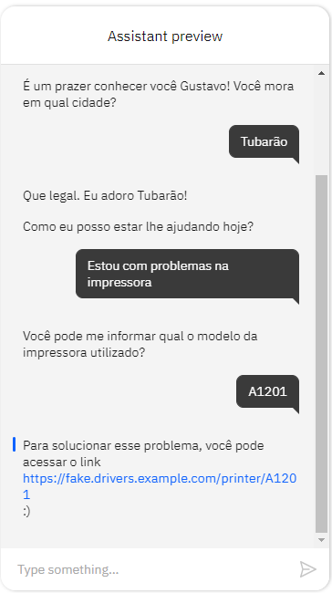

# <p align='center'> **Desafio 04 - Algar Tech**

  - [**1. Sobre a Algar Tech**](#1-sobre-a-algar-tech)
  - [**2. Desafio de Negócio**](#2-desafio-de-negócio)
  - [**3. Objetivo**](#3-objetivo)
  - [**4. Tecnologias Aplicadas**](#4-tecnologias-aplicadas)
  - [**5. Desenvolvimento da Solução**](#5-desenvolvimento-da-solução)
  - [**6. Submissão**](#6-submissão)
  - [**7. Sobre a Avaliação**](#7-sobre-a-avaliação)
  - [**8. Solução**](#8-solução)

## **1. Sobre a Algar Tech**
Há 21 anos a Algar Tech repensou a experiência dos seus clientes e a gestão do ambiente de tecnologia, com o propósito de conectar pessoas e organizações de um jeito único para ser o melhor parceiro para os seus melhores resultados.

A Algar Tech atua em toda a América Latina e a sua missão é conectar pessoas e organizações de um jeito único. Foi criada para quem busca resultados, e por isso se comprometem a transformar o relacionamento entre clientes e empresas por meio de soluções inteligentes.

## **2. Desafio de Negócio**
Estamos a bordo de uma revolução tecnológica que vem modificando a maneira como as empresas conduzem os negócios. E o processo de relacionamento com o cliente não é diferente. O distanciamento social imposto pela pandemia acelerou a implantação de tecnologias, como a Inteligência Artificial (IA), no antendimento ao consumidor nos mais diferentes canais digitais.

Nesse sentido, os ***chatbots*** fundamentais para otimizar o atendimento, fornecendo respostas rápidas, padronizadas, corretas, seguras e garantindo um sentimento de conexão com o cliente durante o atendimento. O nosso desafio é integrar os *chatbots* e o atendimento humano numa interação de chat com um cliente, que será atendido pelo atendimento automatizado e transferido para o assessor quando é necessária a interação humana.

## **3. Objetivo**
O objetivo foi realizar a criação de um assistente virtual que será utilizada por uma empresa de informática, a Fake IT Solutions, em uma página web. O cliente final deve poder fazer consultas e ser direcionado a um atendimento humano, quando necessário. Durante o chat, o assistente deverá responder informações sobre os serviços da empresa, ajudar o cliente a solucionar alguns tipos de problemas, e, ao identificar que não foi possível solucionar um problema, transferir o chat para o atendente humano.

## **4. Tecnologias Aplicadas**
Para este desafio foi utilizado o [Watson Assistant](https://cloud.ibm.com/catalog/services/watson-assistant), uma plataforma disponibilizada na IBM Cloud, para criação de chatbots de forma fácil, por meio intenções, entidades e fluxo de diálogos, e diversas possibilidades de integrações.

## **5. Desenvolvimento da Solução**
O desafio consistiu na implementação de um assistente virtual baseado em *Watson Assistant*.

O fluxo de conversação esperado é o seguinte :

```text
1. Ao iniciar uma conversa, o assistente deverá sempre se apresentar e perguntar ao cliente como deseja ser chamado. Nenhuma validação precisa ser feita na resposta.

2. Após a captura do nome, o assistente deve perguntar qual a cidade do cliente. Nenhuma validação precisa ser feita no nome da cidade.

3. Após a captura da cidade, o assistente deve perguntar como pode ajudar.

3.1. Caso o cliente diga que tem um problema, o assistente deverá perguntar qual problema o cliente está enfrentando, e seguir para as condições 3.2. e 3.3.

3.2. Caso o cliente diga que tem um problema para utilizar uma impressora local, o assistente deverá perguntar qual o modelo da impressora, e responder de acordo com o modelo. Caso seja um modelo conhecido, o assistente deve enviar o link de seu driver, caso contrário, o fluxo deve seguir para a condição 3.3, tendo como descrição do problema o modelo da impressora. As referências de modelo e links de drivers esperados estão na Tabela 1, abaixo.

3.3. Caso o cliente diga que tem algum outro problema, o assistente deverá salvar essa descrição do problema e perguntar se pode transferir o cliente para um atendente humano, e, se sim, seguir para a condição 3.3.1. Se não, o assistente deve perguntar se pode ajudar em algo mais e voltar para o fluxo inicial.

3.3.1. Caso o cliente queira ser transferido a um atendente humano, o assistente deverá realizar uma chamada para uma API via Webhook, enviando como parâmetro o nome do cliente, sua cidade, e a descrição de seu problema. O Webhook responderá se há um atendente humano disponível ou não. Os detalhes para a comunicação com essa API estão na próxima sessão.

3.3.1.1. Caso um atendente humano esteja disponível, o assistente deve dizer que irá transferir e encerrar a conversação.

3.3.1.2. Caso um atendente humano não esteja disponível, o assistente deve dizer para tentar novamente em breve e encerrar a conversação.

4. Quando questionado sobre a empresa, ou sobre os serviços que oferece, o assistente deve discorrer um pouco sobre a empresa de informática, e dizer que no momento está oferecendo somente ajuda para problemas com impressoras. Essa resposta deve necessariamente conter o nome "Fake IT Solutions" e "problemas com impressoras".
```

| Modelo | Driver                                                                                              |
| ------ | --------------------------------------------------------------------------------------------------- |
| A1201  | https://fake.drivers.example.com/printer/A1201                                                      |
| A1202  | https://fake.drivers.example.com/printer/A1202                                                      |
| A1203  | https://fake.drivers.example.com/printer/A1203                                                      |
| B904   | https://fake.drivers.example.com/printer/B904                                                       |
| B905   | https://fake.drivers.example.com/printer/B905                                                       |
| Outro  | Desconhecido. Ir ao passo 3.3. do fluxo de conversação, usando o modelo como descrição do problema. |

**Sobre o Webhook** <br>
Para verificar se um atendente humano está disponível, uma chamada API devia ser feita para o seguinte endereço : https://help.maratona.dev. Essa chama devia ser um POST, contendo um JSON com os seguintes parâmetros :

```json
{
  "name": "Nome do cliente",
  "city": "Cidade do cliente",
  "problem": "Descrição do problema"
}
```

A API responderá com o seguinte JSON, podendo ter o valor `true` ou `false`:

```json
{
  "available": true
}
```

## **6. Submissão**
Para a entrega do desafio, necessitamos de quatro valores, que são :
- API Key e URL do Watson Assistant.
- Skill ID, presente nos detalhes da skill.
- Assistant ID, presente nos detalhes do assistente.

## **7. Sobre a Avaliação**
A avaliação do *chatbot* foi realizada de forma automática e utilizou as credenciais enviadas para calcular uma pontuação numérica de 1 até 100, com base no nível de assertividade das respostas do assistente, de acordo com o fluxo de conversação esperado.

## **8. Solução**
O desenvolvimento de um *chatbot* através do *Watson Assistant* é realizado através de três (3) componentes principais, que são :

***Dialog* (Diálogo)** <br>
*Dialog* é onde realizamos a criação do fluxograma de conversação, podendo configurar o que o nosso *chatbot* irá responder de acordo com a intenção ou entidade que ele reconhecer.

***Intents* (Intenções)** <br>
*Intents* é onde colocamos frases que acreditamos que um usuário irá usar ao conversar com o *chatbot*. 

Um exemplo utilizado foi a intenção do usuário de informar que está com problemas na impressora. Realizamos a criação de uma intenção denominada **"Problema_impressora"** e dentro dela inserimos algumas frases para o *chatbot* entender que um usuário está com problemas, por exemplo :
- "A minha impressora está com problemas" 
- "Estou com um problema na minha impressora" 
- "Não consigo usar a minha impressora"

Nessa etapa quanto mais frases exemplos, mais o *chatbot* irá compreender.

***Entities* (Entidades)** <br>
*Entities* é onde colocamos pontos de dados ou valores que queremos que seja extraídos de uma conversa.

Um exemplo de entidade que foi criada nesse projeto foi "**modelos_impressora**", onde inserimos os diferentes modelos de impressora para que o *chatbot* conseguisse extrair o modelo de uma impressora em uma frase e tomasse ações diferentes para cada modelo.

Abaixo temos um exemplo de conversa com o *chatbot* criado :

