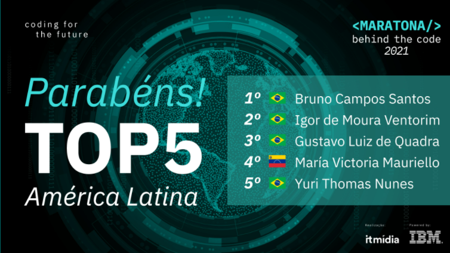

# 
 **Maratona Behind the Code 2021**

  - [**1. Sobre a Maratona**](#1-sobre-a-maratona)
  - [**2. Edição de 2021**](#2-edição-de-2021)
    - [**2.1 Premiação**](#21-premiação)
  - [**3. Desafios**](#3-desafios)
    - [Desafio 01 - Bantotal](#desafio-01---bantotal)
    - [Desafio 02 - Quanam](#desafio-02---quanam)
    - [Desafio 03 - GFT](#desafio-03---gft)
    - [Desafio 04 - Algar Tech](#desafio-04---algar-tech)
    - [Desafio 05 - SONDA](#desafio-05---sonda)
  - [**4. Resultados na Maratona**](#4-resultados-na-maratona)

## **1. Sobre a Maratona**
A Maratona Behind the Code é um evento realizado desde 2019 pela IBM e seus parceiros para desenvolvedores e entusiastas da América Latina (Argentina, Brasil, Chile, Colômbia, Equador, México, Peru, Uruguai e Venezuela), onde as suas 3 edições já reuniram mais de 100.000 desenvolvedores juntas.

O objetivo da maratona é a resolução de desafios de negócios do mundo real aplicando tecnologias disruptivas incluindo Inteligência Artificial, Internet of Things (IoT) e Ciência de Dados, todas elas disponíveis na [IBM Cloud](https://cloud.ibm.com/).

## **2. Edição de 2021**
A Maratona Behind the Code 2012 foi realizada pela IBM em parceria com a IT Mídia entre os dias 12/11/2021 à 18/12/2021 e contou com o apoio de aprceiros como Algar Tech, Bantonal, GFT, Quanam e SONDA.

A etapa inicial da maratona consistia em resolução de 5 desafios entre os dias 12/11/2021 à 12/12/2021, onde foram definidos os TOP 100 desenvolvedores que passariam para o desafio final realizado no dia 18/12/2021.

### **2.1 Premiação**
Os vencedores da Maratona receberam o título de Master Devs da região e vouchers de viagem adicionais para impulsionar o prêmio anteriormente entregados pela IT Mídia ao TOP 100.

No geral, outros prêmios foram oferecidos aos participantes durante a Maratona Behind the Code 2021 como a possibilidade de participar de entrevistas de emprego na IBM Consulting América Latina, vouchers em dólares para resgatar em marketplaces e bolsas da Digital House para realização de cursos online em Marketing Digital, Data Analytics, Programação Web ou Data Science.

## **3. Desafios**
### [Desafio 01 - Bantotal](Desafio01)
- *[Certificado de Participação](certificados/Desafio01-Bantotal.pdf)*
- Ranking : 45º
### [Desafio 02 - Quanam](Desafio02)
- *[Certificado de Participação](certificados/Desafio02-Quanam.pdf)*
- Ranking : 80º
### [Desafio 03 - GFT](Desafio03)
- *[Certificado de Participação](certificados/Desafio03-GFT.pdf)*
- Ranking : 47º
### [Desafio 04 - Algar Tech](Desafio04)
- *[Certificado de Participação](certificados/Desafio04-AlgarTech.pdf)*
- Ranking : 25º
### [Desafio 05 - SONDA](Desafio05)
- *[Certificado de Participação](certificados/Desafio05-SONDA.pdf)*
- Ranking : 74º
## **4. Resultados na Maratona**
🏆 **TOP 100 (25º) do Ranking Geral da Maratona Behind the Code**  
🏆 **TOP 5 Vencedores da Maratona Behind the Code 2021 após 3º lugar no Desafio Final para o TOP 100**.

